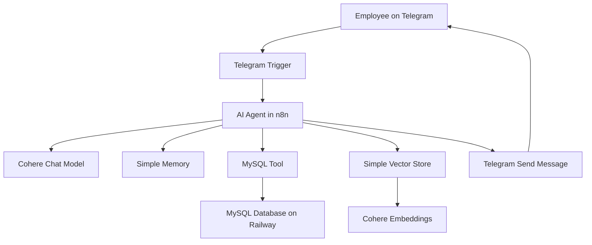

# HR Buddy - AI Agent for Human Resources

HR Buddy is an AI-powered Human Resources assistant built with n8n, Cohere, MySQL, RAG, and Telegram.

The idea behind this project is simple: instead of asking HR the same operational questions over and over, employees can talk to a Telegram bot that understands the request, checks the right source of information, and responds in natural language.

This project was developed during the Oracle + Alura immersion program on AI agents, as part of the hands-on exercises proposed throughout the classes.

I organized it as a portfolio project to document not only the final workflow, but also the architecture, the technical decisions, and the concepts practiced during the implementation.

---

## What this project does

HR Buddy can answer two main types of HR questions:

1. General HR policy questions  
   Example: vacation rules, working hours, internal policies, and general benefits.

2. Employee-specific questions  
   Example: vacation balance, department, role, work model, and time bank information.

To do this, the agent combines two different knowledge sources:

- A Vector Store for semantic search over HR policy documents;
- A MySQL database for structured employee records.

The agent decides which tool to use based on the user's message.

---

## Why this matters

A chatbot that only generates text is useful, but limited.

This project explores a more practical architecture: an AI agent connected to real tools, external data, and an automation workflow.

That means the assistant is not just answering from memory. It can:

- Retrieve information from documents;
- Query structured data from a database;
- Keep conversational context;
- Respond through a real communication channel;
- Be exported, documented, and reused through n8n workflow JSON.

For me, this project was important because it helped connect several concepts that are often studied separately: LLMs, RAG, embeddings, databases, APIs, automation, and conversational interfaces.

---

## Main architecture




## Technology stack

## Technology Role in the project

n8n |	Workflow orchestration and agent automation
Cohere | Chat model and embedding model
MySQL |	Structured employee data
Railway |	Cloud database hosting
Telegram | User interface through a bot
RAG |	Retrieval-Augmented Generation for HR policies
Vector Store | Semantic search over internal documents
JSON | Exported n8n workflow format

---

## How the flow works

The workflow starts when a user sends a message to the Telegram bot.
The message is received by the Telegram Trigger in n8n and passed to the AI Agent. From there, the agent decides what to do:

  - If the question is about general HR rules, it searches the Vector Store.
  - If the question is about a specific employee, it queries MySQL.
  - If the user has already provided their name, the Simple Memory keeps that context.
  - After generating the answer, n8n sends the response back through Telegram.
    
In practice, the flow looks like this:
```
Telegram message
        ↓
n8n Telegram Trigger
        ↓
AI Agent
        ↓
Tool selection
   ┌────┴────┐
   ↓         ↓
Vector    MySQL
Store     Database
   ↓         ↓
Generated answer
        ↓
Telegram response
```

---

## Screenshots

### 1. Creating the Telegram bot 
The Telegram bot was created using BotFather, the official Telegram tool for creating and managing bots.
     //img

### 2. Building the workflow in n8n 
The main workflow connects the Telegram Trigger, AI Agent, Cohere model, memory, MySQL tool, Vector Store, and Telegram response node.
     //img

# 3. Configuring the AI Agent 
The AI Agent is responsible for interpreting the user message, deciding which tool to use, and generating the final response.
      //img

# 4. Connecting the Vector Store 
The Vector Store is used to retrieve relevant HR policy information through semantic search.
     //img

# 5. Connecting MySQL 
The MySQL tool allows the agent to retrieve structured employee information, such as vacation balance and work model.
     //img

# 6. Testing the bot on Telegram 
After publishing the workflow, the assistant can answer directly inside Telegram.
      //img

---

## Example conversation

```
User:
Hello

HR Buddy:
Hello. How can I help you today? Please provide your full name so I can check your information.

User:
Maria Souza

HR Buddy:
Hello, Maria Souza. How can I help you today?

User:
I would like to know about my vacation balance.

HR Buddy:
According to our records, you have 5 vacation days available.
```
This example shows the agent using conversational memory and querying structured data from MySQL.

---

## Database structure

The project uses a MySQL table called funcionarios to store employee information.

```
CREATE TABLE funcionarios (
    id INT AUTO_INCREMENT PRIMARY KEY,
    nome VARCHAR(100) NOT NULL,
    email VARCHAR(150) NOT NULL UNIQUE,
    departamento VARCHAR(100) NOT NULL,
    cargo VARCHAR(100) NOT NULL,
    data_admissao DATE NOT NULL,
    saldo_ferias INT NOT NULL DEFAULT 0,
    banco_horas DECIMAL(5,1) NOT NULL DEFAULT 0,
    regime VARCHAR(20) NOT NULL DEFAULT 'hibrido'
);
```

The full database script is available at:
```
database/schema.sql
```

---

## Exported n8n workflow

The n8n workflow was exported as a JSON file and included in this repository.
```
workflows/telegram-agent.json
```

A simplified example of the exported structure:
```
{
  "name": "Aula 3 - HR Buddy",
  "nodes": [
    {
      "name": "Telegram Trigger",
      "type": "n8n-nodes-base.telegramTrigger"
    },
    {
      "name": "AI Agent",
      "type": "@n8n/n8n-nodes-langchain.agent"
    },
    {
      "name": "Send a text message",
      "type": "n8n-nodes-base.telegram"
    }
  ],
  "connections": {}
}
```

The full workflow JSON is available in the workflows folder.

---

## How to import the workflow

To import this workflow into n8n:

  1. Open your n8n instance.
  2. Go to the workflow editor.
  3. Click the menu with three dots.
  4. Select the import option.
  5. Upload the JSON file from the workflows folder.
  6. Configure your own credentials.
  7. Test the workflow.
  8. Publish or activate it.

Required credentials:
```
Cohere API Key
Telegram Bot Token
MySQL host
MySQL port
MySQL database
MySQL user
MySQL password
```

---

## Repository structure

```
hr-buddy-ai-agent/
├── README.md
├── workflows/
│   └── telegram-agent.json
├── database/
│   └── schema.sql
├── docs/
│   ├── introductory-class.md
│   ├── class-1-rag-embeddings-n8n.md
│   ├── class-2-mysql-and-memory.md
│   └── class-3-telegram-automation.md
├── assets/
│   └── screenshots/
│       ├── 01-botfather-telegram-bot.png
│       ├── 02-n8n-workflow-overview.png
│       ├── 03-ai-agent-configuration.png
│       ├── 04-vector-store-configuration.png
│       ├── 05-mysql-configuration.png
│       └── 06-telegram-test.png
├── .env.example
├── .gitignore
└── LICENSE
```

---

## What I learned

This project helped me practice and understand several concepts related to AI agents and workflow automation:

 - How to build an AI agent with n8n;
 - How to connect an LLM to external tools;
 - How RAG improves answers by retrieving relevant context;
 - How embeddings are used for semantic search;
 - How a Vector Store supports document-based retrieval;
 - How to connect an AI workflow to a MySQL database;
 - How conversational memory works in a chatbot;
 - How Telegram can be used as a real user interface;
 - How to export and version an n8n workflow as JSON;
 - Why credentials and sensitive data must be protected before publishing a project.

---

## Final note

This project started as a learning exercise, but it became a practical example of how AI agents can be connected to real tools and business workflows.

The most valuable part was understanding that an AI agent is not just a chatbot. It is a system that combines reasoning, context, tools, memory, and automation to complete tasks in a more useful way.

---

## License

This project is licensed under the MIT License.


