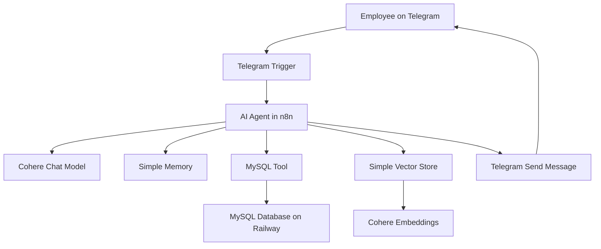
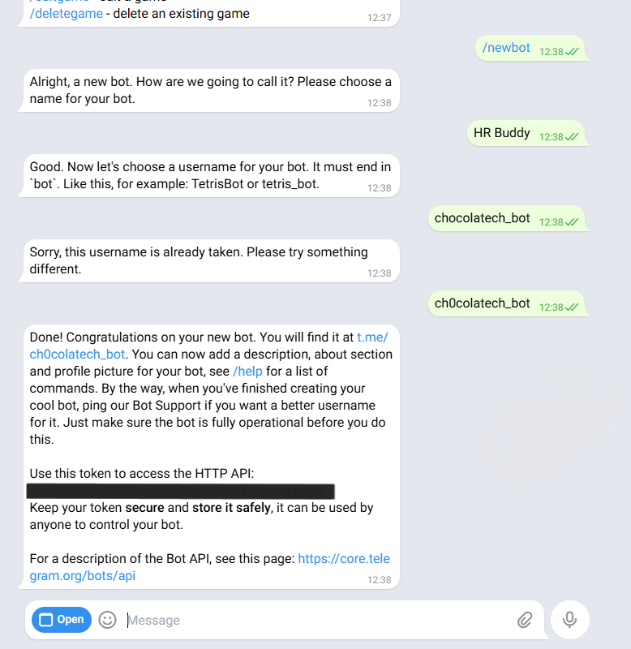
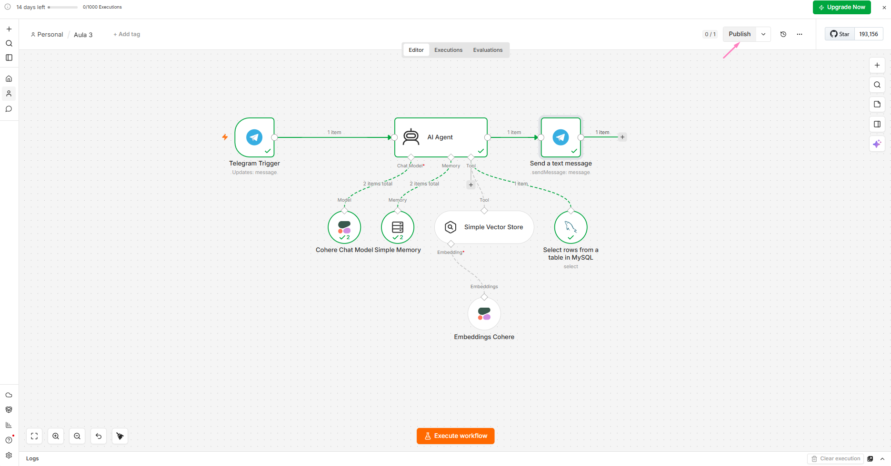
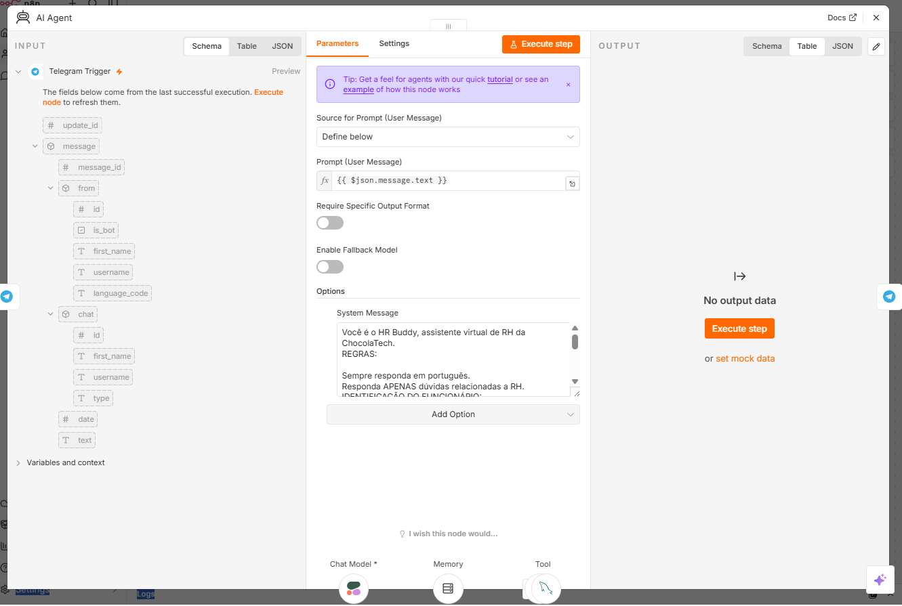
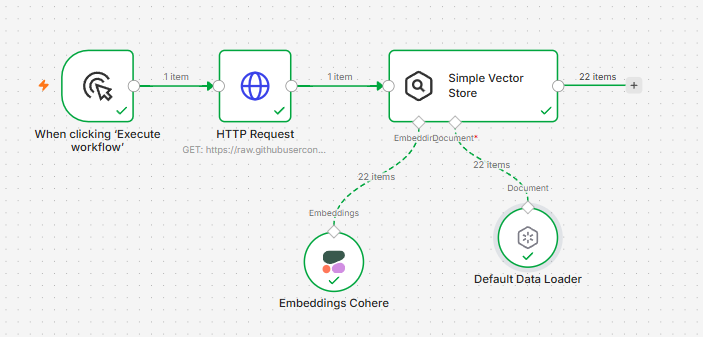
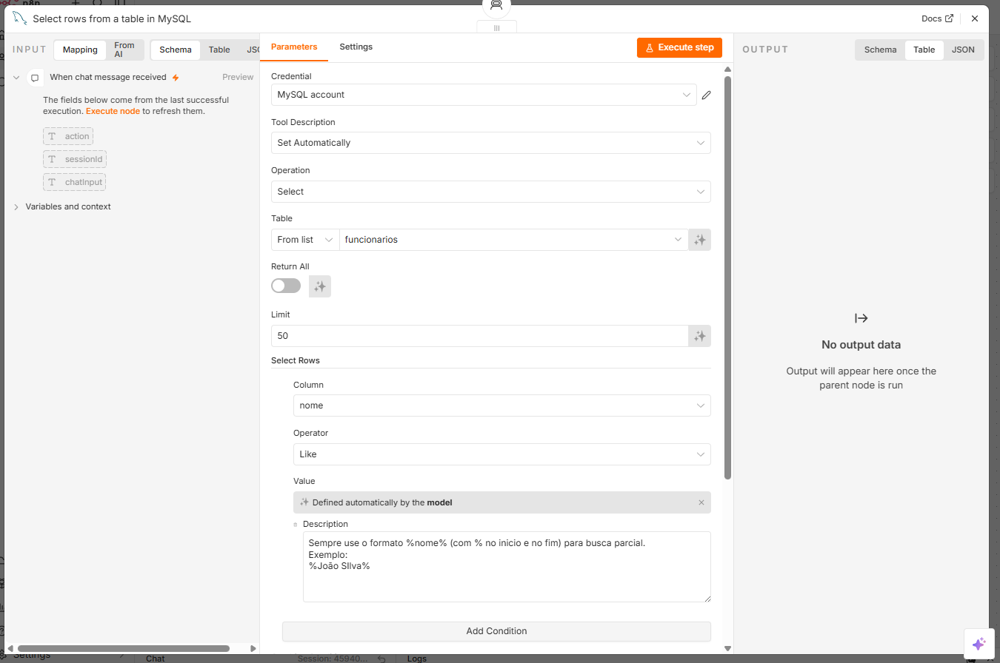
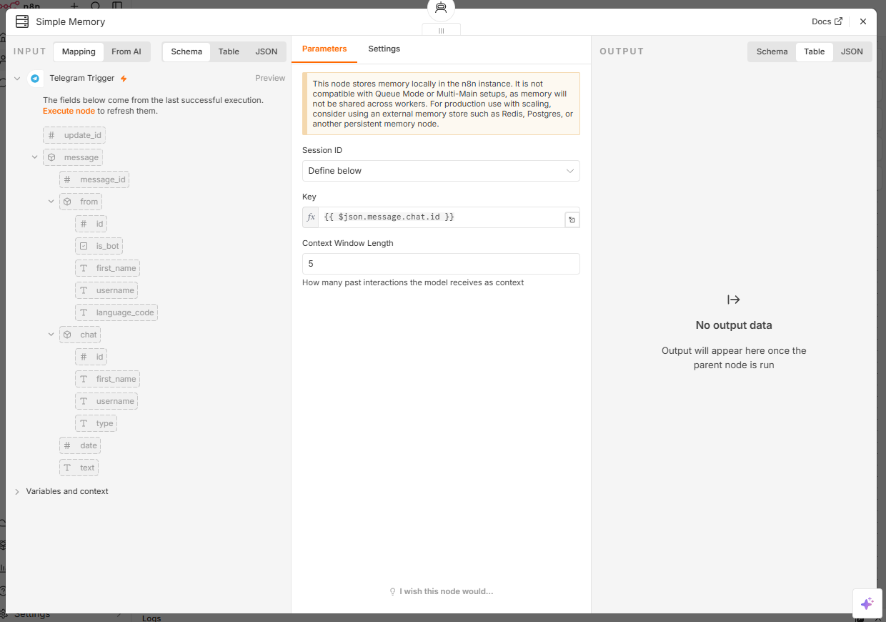
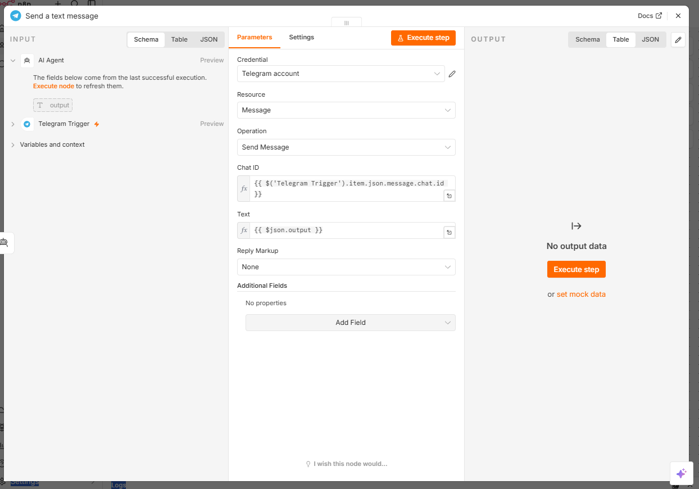
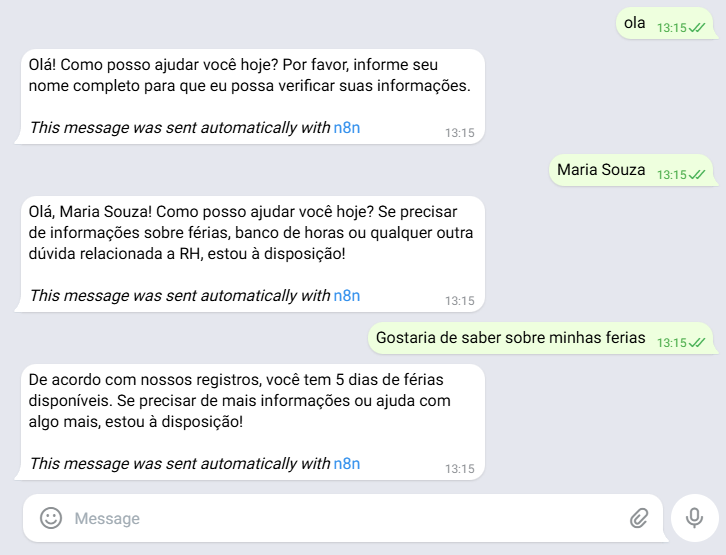

<div align="center">

# HR Buddy

### AI Agent for Human Resources Support

An AI-powered HR assistant that connects Telegram, n8n, Cohere, MySQL, and RAG to answer employee questions through a real chatbot workflow. 

</div>

<div align="center">


</div> 

---

## Project Snapshot

<table>
  <tr>
    <td><strong>Project Type</strong></td>
    <td>AI agent proof of concept</td>
  </tr>
  <tr>
    <td><strong>Main Goal</strong></td>
    <td>Automate HR support using conversational AI, structured data, and document retrieval</td>
  </tr>
  <tr>
    <td><strong>User Interface</strong></td>
    <td>Telegram bot</td>
  </tr>
  <tr>
    <td><strong>Automation Layer</strong></td>
    <td>n8n workflow</td>
  </tr>
  <tr>
    <td><strong>AI Model Provider</strong></td>
    <td>Cohere</td>
  </tr>
  <tr>
    <td><strong>Data Sources</strong></td>
    <td>Vector Store for HR policies and MySQL for employee records</td>
  </tr>
</table>

---

## Navigation

<table>
  <tr>
    <td><a href="#overview"><strong>Overview</strong></a><br>What the project is about.</td>
    <td><a href="#why-it-matters"><strong>Why It Matters</strong></a><br>The business and technical value.</td>
  </tr>
  <tr>
    <td><a href="#architecture"><strong>Architecture</strong></a><br>How the components work together.</td>
    <td><a href="#workflow"><strong>Workflow</strong></a><br>How the message flows through the system.</td>
  </tr>
  <tr>
    <td><a href="#screenshots"><strong>Screenshots</strong></a><br>Visual implementation steps.</td>
    <td><a href="#database"><strong>Database</strong></a><br>MySQL table used in the project.</td>
  </tr>
  <tr>
    <td><a href="#n8n-workflow"><strong>n8n Workflow</strong></a><br>Exported JSON workflow.</td>
    <td><a href="#security"><strong>Security</strong></a><br>Credential and privacy notes.</td>
  </tr>
  <tr>
    <td><a href="#learnings"><strong>Learnings</strong></a><br>Main concepts practiced.</td>
    <td><a href="#next-steps"><strong>Next Steps</strong></a><br>Possible improvements.</td>
  </tr>
</table>

---

<a id="overview"></a>

## Overview

HR Buddy is an AI-powered Human Resources assistant developed during the Oracle + Alura immersion program on AI agents.

The project simulates a real HR support workflow where an employee can send a message through Telegram and receive an answer based on either:

- HR policy documents;
- Structured employee data stored in MySQL.

The goal was not only to build a chatbot, but to understand how an AI agent can use tools, memory, databases, and document retrieval to perform useful tasks.

---

<a id="why-it-matters"></a>

## Why It Matters

A simple chatbot can answer based on text generation.

An AI agent can go further.

HR Buddy demonstrates how an AI system can:

- Understand a user request;
- Decide which tool to use;
- Search documents through RAG;
- Query structured data from MySQL;
- Keep conversational context;
- Send the answer back through Telegram.

This project helped me connect concepts that are often studied separately: LLMs, embeddings, RAG, databases, APIs, memory, and automation.

> [!NOTE]
> This is a proof of concept created for learning and portfolio purposes. It is not a production-ready HR system.

---

<a id="architecture"></a>

## Architecture



---

## Technology Stack

| Technology | Role |
|---|---|
| n8n | Workflow orchestration and AI agent automation |
| Cohere | Chat model and embedding model |
| MySQL | Structured employee data |
| Railway | Cloud hosting for MySQL |
| Telegram | Chatbot interface |
| RAG | Retrieval-Augmented Generation for HR policies |
| Vector Store | Semantic search over internal documents |
| JSON | Exported n8n workflow format |

---

<a id="workflow"></a>

## Workflow

The workflow starts when a user sends a message to the Telegram bot.

```text
Telegram message
        |
        v
n8n Telegram Trigger
        |
        v
AI Agent
        |
        v
Tool selection
   |             |
   v             v
Vector Store    MySQL Database
   |             |
   v             v
Generated answer
        |
        v
Telegram response
```

The agent decides what to do based on the request:

| User intent | Tool used |
|---|---|
| General HR policy question | Vector Store |
| Employee-specific question | MySQL |
| Follow-up question | Simple Memory |
| Final response | Telegram Send Message |

---

<a id="screenshots"></a>

## Screenshots

The screenshots below show the main parts of the implementation.

### Creating the Telegram Bot

The bot was created using BotFather, the official Telegram tool for creating and managing bots.



---

### n8n Workflow Overview

The complete workflow connects Telegram, the AI Agent, Cohere, memory, MySQL, Vector Store, and the Telegram response node.



---

### AI Agent Configuration

The agent receives the Telegram message text as input and follows a system message that defines its behavior.



---

### Vector Store and Embeddings

The Vector Store retrieves HR policy information using semantic search powered by Cohere embeddings.



---

### MySQL Tool

The MySQL tool searches the `funcionarios` table using the employee name.



---

### Conversation Memory

The memory node uses the Telegram `chat.id` as the session identifier.



---

### Telegram Response

The final response is sent back to the same Telegram chat.



---

### Final Test

The assistant identifies the employee, keeps the conversation context, queries MySQL, and returns the vacation balance.



---

## Example Conversation

```text
User:
Hello

HR Buddy:
Hello. How can I help you today? Please provide your full name so I can check your information.

User:
Maria Souza

HR Buddy:
Hello, Maria Souza. How can I help you today?

User:
I would like to know about my vacation balance.

HR Buddy:
According to our records, you have 5 vacation days available.
```

---

<a id="database"></a>

## Database

The project uses a MySQL table called `funcionarios` to store fictitious employee information.

```sql
CREATE TABLE funcionarios (
    id INT AUTO_INCREMENT PRIMARY KEY,
    nome VARCHAR(100) NOT NULL,
    email VARCHAR(150) NOT NULL UNIQUE,
    departamento VARCHAR(100) NOT NULL,
    cargo VARCHAR(100) NOT NULL,
    data_admissao DATE NOT NULL,
    saldo_ferias INT NOT NULL DEFAULT 0,
    banco_horas DECIMAL(5,1) NOT NULL DEFAULT 0,
    regime VARCHAR(20) NOT NULL DEFAULT 'hibrido'
);
```

The full script is available at:

```text
database/schema.sql
```

---

<a id="n8n-workflow"></a>

## Exported n8n Workflow

The workflow was exported from n8n as a JSON file and versioned in this repository.

```text
workflows/telegram-agent.json
```

<details>
  <summary>View simplified workflow structure</summary>

```json
{
  "name": "Aula 3 - HR Buddy",
  "nodes": [
    {
      "name": "Telegram Trigger",
      "type": "n8n-nodes-base.telegramTrigger"
    },
    {
      "name": "AI Agent",
      "type": "@n8n/n8n-nodes-langchain.agent"
    },
    {
      "name": "Send a text message",
      "type": "n8n-nodes-base.telegram"
    }
  ],
  "connections": {}
}
```

</details>

---

## How to Import the Workflow

1. Open your n8n instance.
2. Go to the workflow editor.
3. Click the menu with three dots.
4. Select the import option.
5. Upload the JSON file from the `workflows` folder.
6. Configure your own credentials.
7. Test the workflow.
8. Publish or activate it.

Required credentials:

```text
Cohere API Key
Telegram Bot Token
MySQL host
MySQL port
MySQL database
MySQL user
MySQL password
```

---

<a id="security"></a>

## Security

> [!IMPORTANT]
> This repository does not include real credentials, API keys, Telegram tokens, or private database passwords.

Before publishing any n8n workflow publicly, it is important to check that the exported JSON does not contain sensitive information.

Do not commit:

- Telegram bot tokens;
- Cohere API keys;
- MySQL passwords;
- Railway connection strings;
- Authorization headers;
- Personal or sensitive employee data.

For a real HR environment, authentication and access control would be mandatory before exposing any employee-specific information.

---

## Repository Structure

```text
hr-buddy-ai-agent/
|-- README.md
|-- workflows/
|   |-- telegram-agent.json
|-- database/
|   |-- schema.sql
|-- docs/
|   |-- introductory-class.md
|   |-- class-1-rag-embeddings-n8n.md
|   |-- class-2-mysql-and-memory.md
|   |-- class-3-telegram-automation.md
|-- assets/
|       |-- 01-botfather-telegram-bot.png
|       |-- 02-n8n-workflow-overview.png
|       |-- 03-ai-agent-configuration.png
|       |-- 04-vector-store-configuration.png
|       |-- 05-mysql-tool-configuration.png
|       |-- 06-simple-memory-session-id.png
|       |-- 07-telegram-send-message.png
|       |-- 08-telegram-final-test.png
|-- .env.example
|-- .gitignore
|-- LICENSE
```

---

<a id="learnings"></a>

## Key Learnings

This project helped me practice:

- Building an AI agent with n8n;
- Connecting an LLM to external tools;
- Understanding the difference between chat models and embedding models;
- Using RAG for document-based answers;
- Generating embeddings for semantic search;
- Connecting MySQL to an AI workflow;
- Managing conversational memory with a session ID;
- Using Telegram as a real chatbot interface;
- Exporting and versioning n8n workflows as JSON;
- Documenting a technical project for portfolio purposes;
- Handling credentials safely in a public repository.

---

<a id="next-steps"></a>

## Future Improvements

This project is a proof of concept. Some possible improvements are:

- Add real user authentication;
- Validate employee identity before returning personal information;
- Store memory in an external database;
- Add error handling for unavailable APIs or database failures;
- Add logs for monitoring and auditability;
- Improve database modeling;
- Add human handoff for sensitive HR topics;
- Create a Docker-based local setup;
- Add automated tests for expected conversation flows.

---

## Additional Documentation

Detailed learning notes and implementation breakdowns are available in the `docs` folder:

- [Introductory Class](docs/introductory-class.md)
- [Class 1 - RAG, Embeddings and n8n](docs/class-1-rag-embeddings-n8n.md)
- [Class 2 - MySQL and Memory](docs/class-2-mysql-and-memory.md)
- [Class 3 - Telegram Automation](docs/class-3-telegram-automation.md)

---

<a id="final-note"></a>

## Final Note

This project started as a hands-on exercise during an AI agents immersion program, but it became a practical way to understand how AI systems can be connected to real tools and business workflows.

The main takeaway was that an AI agent is not just a chatbot. It is a system that combines language understanding, context retrieval, structured data, memory, and automation to complete useful tasks.

---

## License

This project is licensed under the MIT License.
