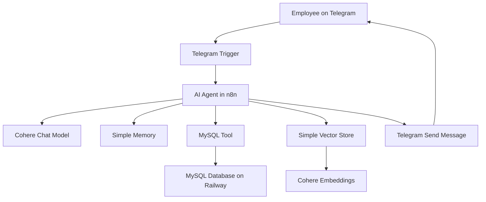

<div align="center">

# HR Buddy

### AI Agent for Human Resources Support

An AI-powered HR assistant built with n8n, Cohere, MySQL, RAG, and Telegram.

HR Buddy receives employee questions through Telegram, understands the request, chooses the right data source, and sends back a contextual answer through an automated AI workflow.

</div>

---

<div align="center">


</div>

---

## Navigation

<table>
  <tr>
    <td><a href="#project-overview"><strong>Project Overview</strong></a><br>What HR Buddy is and what it solves.</td>
    <td><a href="#why-this-project-matters"><strong>Why This Project Matters</strong></a><br>The business and technical value behind the solution.</td>
  </tr>
  <tr>
    <td><a href="#architecture"><strong>Architecture</strong></a><br>How Telegram, n8n, Cohere, MySQL, and RAG work together.</td>
    <td><a href="#technology-stack"><strong>Technology Stack</strong></a><br>The tools used and the role of each one.</td>
  </tr>
  <tr>
    <td><a href="#how-the-flow-works"><strong>How the Flow Works</strong></a><br>The workflow from user message to final answer.</td>
    <td><a href="#screenshots"><strong>Screenshots</strong></a><br>Visual documentation of the implementation.</td>
  </tr>
  <tr>
    <td><a href="#example-conversation"><strong>Example Conversation</strong></a><br>A practical interaction with the Telegram bot.</td>
    <td><a href="#database-structure"><strong>Database Structure</strong></a><br>The MySQL table used for employee data.</td>
  </tr>
  <tr>
    <td><a href="#exported-n8n-workflow"><strong>Exported n8n Workflow</strong></a><br>The workflow versioned as a JSON file.</td>
    <td><a href="#how-to-import-the-workflow"><strong>How to Import</strong></a><br>How to reuse the workflow in another n8n instance.</td>
  </tr>
  <tr>
    <td><a href="#security-notes"><strong>Security Notes</strong></a><br>Credential handling and safe publishing practices.</td>
    <td><a href="#key-learnings"><strong>Key Learnings</strong></a><br>Concepts practiced while building the project.</td>
  </tr>
  <tr>
    <td><a href="#future-improvements"><strong>Future Improvements</strong></a><br>What could be improved in a production version.</td>
    <td><a href="#final-note"><strong>Final Note</strong></a><br>The main takeaway from this project.</td>
  </tr>
</table>

---

## Project Overview

HR Buddy is a proof of concept for an AI-powered Human Resources assistant.

The project was developed during the Oracle + Alura immersion program on AI agents, as part of the hands-on exercises proposed throughout the classes. I organized it as a portfolio project to document not only the final workflow, but also the architecture, the technical decisions, and the concepts practiced during the implementation.

The assistant can answer two types of HR questions:

1. General HR policy questions  
   Examples: vacation rules, work model, internal policies, benefits, and working hours.

2. Employee-specific questions  
   Examples: vacation balance, department, role, admission date, and time bank information.

To make this possible, the agent combines two different sources of knowledge:

- A Vector Store for semantic search over HR policy documents;
- A MySQL database for structured employee records.

The agent receives the message, interprets the user intent, chooses the appropriate tool, and returns an answer through Telegram.

---

## Why This Project Matters

A basic chatbot can generate text. An AI agent can go further.

This project shows how a language model can be connected to tools, data sources, and automation logic to solve a more realistic business problem.

Instead of relying only on the model's internal knowledge, HR Buddy can:

- Retrieve relevant information from HR documents;
- Query structured employee data from MySQL;
- Keep context during the conversation;
- Respond through a real communication channel;
- Be exported and versioned as an n8n JSON workflow.

The most important part of this project was understanding how different pieces work together: LLMs, embeddings, RAG, databases, APIs, memory, and workflow automation.

---

## Architecture

The project uses n8n as the orchestration layer. Telegram is the user interface, Cohere provides the language and embedding models, MySQL stores employee data, and the Vector Store supports semantic search over HR policies.



---

## Technology Stack

| Technology | Role in the project |
|---|---|
| n8n | Workflow orchestration and AI agent automation |
| Cohere | Chat model and embedding model |
| MySQL | Structured employee data |
| Railway | Cloud hosting for the MySQL database |
| Telegram | User-facing chatbot interface |
| RAG | Retrieval-Augmented Generation for HR policy answers |
| Vector Store | Semantic search over internal documents |
| JSON | Exported n8n workflow format |

---

## How the Flow Works

The workflow starts when an employee sends a message to the Telegram bot.

The message is received by the Telegram Trigger in n8n and passed to the AI Agent. From there, the agent decides which tool should be used.

- If the question is about general HR policies, the agent searches the Vector Store.
- If the question is about a specific employee, the agent queries MySQL.
- If the user has already provided their name, the memory node keeps that context.
- After generating the answer, n8n sends the response back through Telegram.

In practice, the flow works like this:

```text
Telegram message
        |
        v
n8n Telegram Trigger
        |
        v
AI Agent
        |
        v
Tool selection
   |             |
   v             v
Vector Store    MySQL Database
   |             |
   v             v
Generated answer
        |
        v
Telegram response
```

---

## Screenshots

The screenshots below document the main parts of the implementation, from creating the Telegram bot to testing the final assistant.

### 1. Creating the Telegram Bot

The Telegram bot was created using BotFather, the official Telegram tool for creating and managing bots. This step generates the bot identity and the access token used later in n8n as a private credential.


---

### 2. Workflow Overview in n8n

This is the final workflow structure. The Telegram Trigger receives the user message, the AI Agent processes it, and the response is sent back through Telegram.


---

### 3. AI Agent Configuration

The AI Agent receives the Telegram message text as input and follows a system message that defines its role, language, limits, and tool usage rules.


---

### 4. Vector Store and Embeddings

The Vector Store is responsible for storing and retrieving HR policy information. Cohere embeddings are used to represent text semantically, making it possible to search by meaning instead of exact keywords.


---

### 5. MySQL Tool Configuration

The MySQL tool allows the agent to retrieve structured employee data. In this project, it is configured to search the `funcionarios` table using the employee name.


---

### 6. Conversation Memory

The memory node uses the Telegram `chat.id` as the session identifier. This keeps each conversation isolated and allows the assistant to remember context during the interaction.


---

### 7. Sending the Response Back to Telegram

After the AI Agent generates a response, the Telegram node sends the message back to the same chat using the original `chat.id`.


---

### 8. Final Telegram Test

The final test shows the assistant identifying the employee, keeping the conversation context, querying MySQL, and returning the vacation balance.


---

## Example Conversation

```text
User:
Hello

HR Buddy:
Hello. How can I help you today? Please provide your full name so I can check your information.

User:
Maria Souza

HR Buddy:
Hello, Maria Souza. How can I help you today?

User:
I would like to know about my vacation balance.

HR Buddy:
According to our records, you have 5 vacation days available.
```

This example shows the agent using conversational memory and querying structured data from MySQL.

---

## Database Structure

The project uses a MySQL table called `funcionarios` to store employee information.

```sql
CREATE TABLE funcionarios (
    id INT AUTO_INCREMENT PRIMARY KEY,
    nome VARCHAR(100) NOT NULL,
    email VARCHAR(150) NOT NULL UNIQUE,
    departamento VARCHAR(100) NOT NULL,
    cargo VARCHAR(100) NOT NULL,
    data_admissao DATE NOT NULL,
    saldo_ferias INT NOT NULL DEFAULT 0,
    banco_horas DECIMAL(5,1) NOT NULL DEFAULT 0,
    regime VARCHAR(20) NOT NULL DEFAULT 'hibrido'
);
```

The full database script is available at:

```text
database/schema.sql
```

---

## Exported n8n Workflow

The n8n workflow was exported as a JSON file and included in this repository.

```text
workflows/telegram-agent.json
```

A simplified example of the exported structure:

```json
{
  "name": "Aula 3 - HR Buddy",
  "nodes": [
    {
      "name": "Telegram Trigger",
      "type": "n8n-nodes-base.telegramTrigger"
    },
    {
      "name": "AI Agent",
      "type": "@n8n/n8n-nodes-langchain.agent"
    },
    {
      "name": "Send a text message",
      "type": "n8n-nodes-base.telegram"
    }
  ],
  "connections": {}
}
```

The full workflow JSON is available in the `workflows` folder.

---

## How to Import the Workflow

To import this workflow into n8n:

1. Open your n8n instance.
2. Go to the workflow editor.
3. Click the menu with three dots.
4. Select the import option.
5. Upload the JSON file from the `workflows` folder.
6. Configure your own credentials.
7. Test the workflow.
8. Publish or activate it.

Required credentials:

```text
Cohere API Key
Telegram Bot Token
MySQL host
MySQL port
MySQL database
MySQL user
MySQL password
```

---

## Repository Structure

```text
hr-buddy-ai-agent/
|-- README.md
|-- workflows/
|   |-- telegram-agent.json
|-- database/
|   |-- schema.sql
|-- docs/
|   |-- introductory-class.md
|   |-- class-1-rag-embeddings-n8n.md
|   |-- class-2-mysql-and-memory.md
|   |-- class-3-telegram-automation.md
|-- assets/
|   |-- screenshots/
|       |-- 01-botfather-telegram-bot.png
|       |-- 02-n8n-workflow-overview.png
|       |-- 03-ai-agent-configuration.png
|       |-- 04-vector-store-configuration.png
|       |-- 05-mysql-tool-configuration.png
|       |-- 06-simple-memory-session-id.png
|       |-- 07-telegram-send-message.png
|       |-- 08-telegram-final-test.png
|-- .env.example
|-- .gitignore
|-- LICENSE
```

---

## Security Notes

This repository does not include real credentials.

Before publishing any n8n workflow publicly, it is important to check that the exported JSON does not contain sensitive information.

Do not commit:

- Telegram bot tokens;
- Cohere API keys;
- MySQL passwords;
- Railway connection strings;
- Authorization headers;
- Personal or sensitive employee data.

This project uses fictitious employee data and placeholders for credentials.

For a real HR environment, authentication and access control would be mandatory before exposing any employee-specific information.

---

## Key Learnings

This project helped me practice several concepts related to AI agents, automation, and applied data integration:

- Building an AI agent with n8n;
- Connecting an LLM to external tools;
- Understanding the difference between a chat model and an embedding model;
- Using RAG to retrieve context from documents;
- Generating embeddings for semantic search;
- Using a Vector Store for document-based retrieval;
- Connecting an AI workflow to a MySQL database;
- Managing conversational memory with a session identifier;
- Using Telegram as a real chatbot interface;
- Exporting and versioning an n8n workflow as JSON;
- Documenting a technical project for portfolio purposes;
- Handling credentials carefully before publishing a public repository.

---

## Additional Documentation

Detailed learning notes and implementation breakdowns are available in the `docs` folder:

- [Introductory Class](docs/introductory-class.md)
- [Class 1 - RAG, Embeddings and n8n](docs/class-1-rag-embeddings-n8n.md)
- [Class 2 - MySQL and Memory](docs/class-2-mysql-and-memory.md)
- [Class 3 - Telegram Automation](docs/class-3-telegram-automation.md)


---

## Final Note

This project started as a hands-on exercise during an AI agents immersion program, but it became a practical way to understand how AI systems can be connected to real tools and business workflows.

The main takeaway was that an AI agent is not just a chatbot. It is a system that combines language understanding, context retrieval, structured data, memory, and automation to complete useful tasks.

---

## License

This project is licensed under the MIT License.
